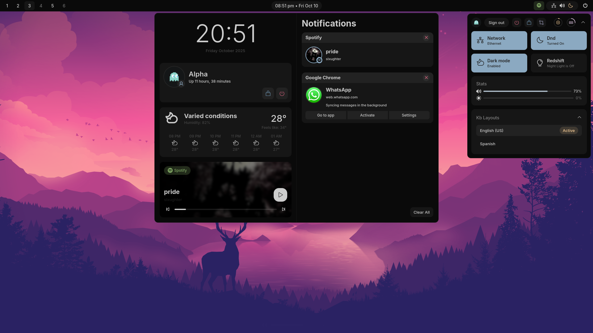
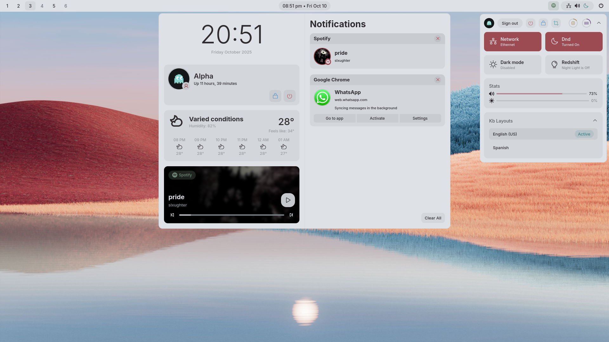

# SShell

> Simple shell

This project aims to provide a simple shell (in terms of design guidelines) which provides a feature rich
desktop environment using Hyprland as the compositor. It is primarily intended for personal use, but I aim
to make it more and more usable to other people in the future by providing quality of life improvements over the time.

## Instructions

Coming soon.
